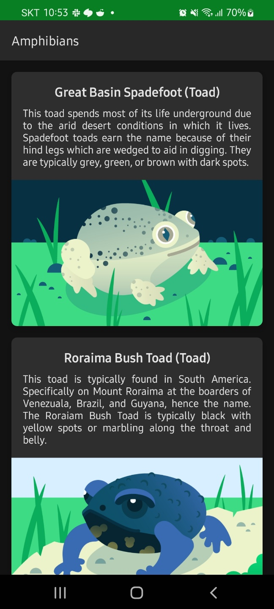

Amphibians app
==================================

Code for Android Basics with Compose Practice Set.

Pre-requisites
--------------

You need to know:
- How to create Composable functions.
- How to use architecture components including ViewModel.
- How to use [Retrofit](https://square.github.io/retrofit/) to retrieve data from the internet.
- How to use [Coil](https://coil-kt.github.io/coil/) to load images.

Getting Started
---------------

1. [Install Android Studio](https://developer.android.com/studio/install.html), if you don't already
   have it.
2. Download the app.
3. Import the app into Android Studio.
4. Build and run the app.

Quest
---------------
1. 작동하지 않는 코드를 완성하세요
2. Bottom navigation 을 추가하세요 
3. Button 을 2개 추가합니다 - Vertical / Horizon
4. 기존의 리스트 페이지를 Vertical 스크린에 출력합니다.
5. 새로운 리스트 페이지를 추가합니다 (Horizon) - 가로로 스크롤 가능한 리스트 페이지여야 합니다.
6. (Optional) Coverage 가 70% 이상 나올 수 있는 Test code 를 추가합니다.

How app looks like
---------------

